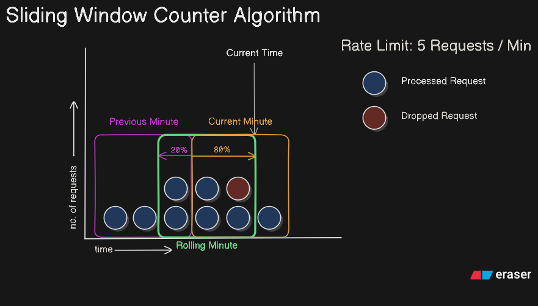

# Rate Limiting for Cinemix

There are several rate limiting algorithms available, but after reviewing a few popular ones, I have decided to implement this specific algorithm.

Before we continue, I want to address one important point:

- Cinemix doesn't need a rate limiter, since it won't be deployed on an actual server, and external API rate limiting is already managed effectively. Caching also reduces a lot of processing.
- **The implementation is purely for learning purposes.**

**Note:** FastAPI does not provide any built-in rate limiting functionality.

## Sliding Window Counter Algorithm

You should do your own research and learning about the algorithm itself, as this documentation only discusses its implementation for Cinemix.

> [You can use this very well-written article to learn about the algorithm](https://bytebytego.com/courses/system-design-interview/design-a-rate-limiter#sliding-window-counter-algorithm)



---

### Tunable Parameters

This algorithm has three tunable parameters:

1. Bucket Size
   - How finely we divide the window into smaller slices. Smaller buckets mean a smoother, more accurate sliding effect but higher CPU and memory usage.
   - For this project, we will use a `10-second bucket size` as the default.
2. Window Size
   - This is the total span of time we care about (e.g., “no more than 5 requests in the last 60 seconds” → window size = 60 seconds).
   - For this project, we will use `1 minute` as the default.
3. Max Threshold
   - The maximum number of requests allowed within the window size. If the total number of requests in the current window exceeds this threshold, further requests are rejected.
   - For this project, we will use `10 requests per window` as the default.

### Implementation

- First, we'll maintain a list of 0s.
  - `The number of items in the list = window size in seconds // bucket size in seconds`
- Then we'll maintain a pointer, which points to the bucket we’re in right now (an index in the list).
  - When the bucket’s time runs out, move the pointer forward.
  - If more than one bucket’s worth of time passes, skip ahead multiple buckets.
    - For example, if 30 seconds pass with a 10-second bucket size, the pointer should move 3 indices.
  - Each time we move to a new bucket, reset it to 0.


- For any incoming request, we'll check the accumulated sum of the list. If it exceeds the max requests threshold, we'll drop the request.
- If it stays under the limit, we'll increment the current bucket by 1 and allow the request.

## Signatures

1. Required Environment Variables:

```python
BUCKET_SIZE: int = 10
WINDOW_SIZE: int = 60
MAX_THRESHOLD: int = 10
```

2. Class and Methods:

```python
class RateLimiter:
    def __init__(self):
        # Initialize tunable parameters

    def allow_request(self) -> bool:
        # Implementation
```

**Note:** The application will use a single instance of the `RateLimiter` class; that is, the same instance will be shared across all endpoints.

### Example Usage

```python
limiter = RateLimiter()
if limiter.allow_request():
    process_request()
else:
    reject_request()
```
